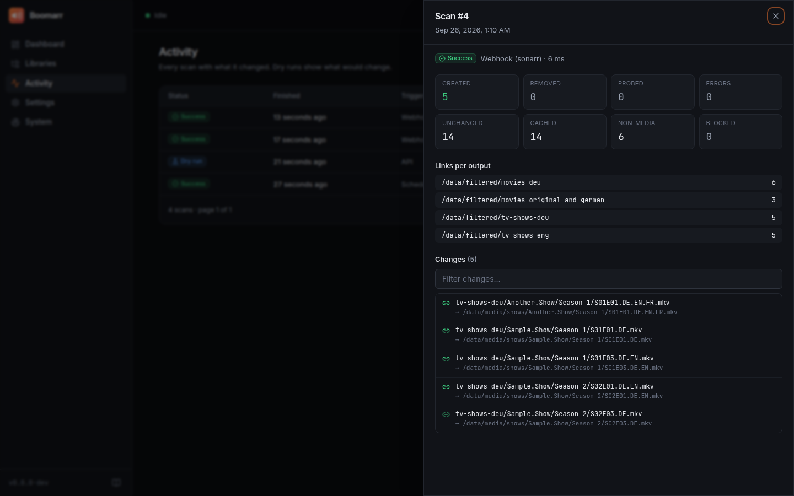
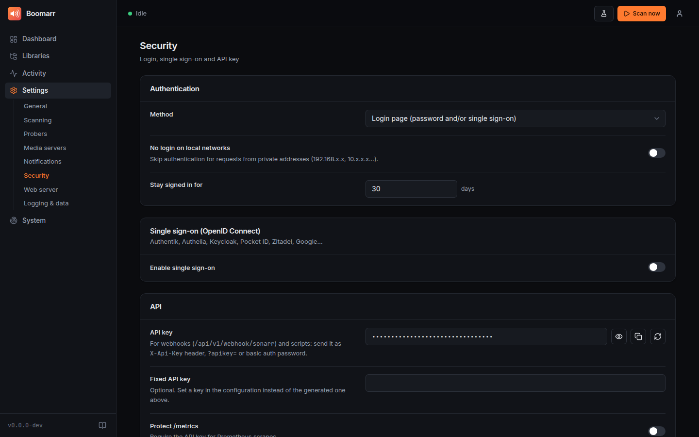

<p align="center">
  
</p>

# Boomarr


[](https://github.com/EuleMitKeule/boomarr/actions/workflows/quality.yml)
[](https://github.com/EuleMitKeule/boomarr/actions/workflows/publish.yml)
[](https://sonarcloud.io/component_measures?id=EuleMitKeule_boomarr&metric=coverage)
[](https://sonarcloud.io/summary/new_code?id=EuleMitKeule_boomarr)
[](https://sonarcloud.io/summary/new_code?id=EuleMitKeule_boomarr)

🔊 **Symlink-based audio language filter for Plex, Jellyfin & Emby** — automatically mirrors your media library, keeping only files with your desired audio tracks.

## What is this?

Your library has German, English and French releases mixed together, but
some people in your household only want to see what they can actually
watch in their language. Boomarr scans your library with ffprobe and builds
separate folders that contain only (symlinks to) the files with the audio
languages you choose. Point a Plex/Jellyfin/Emby library at such a folder
and share it with whoever needs it.

```
/data/media/movies                     /data/filtered/movies-deu
├── Film A (2020)/Film A.mkv  deu,eng  ├── Film A (2020)/Film A.mkv  -> …
├── Film B (2021)/Film B.mkv  eng      ├── Film C (2022)/Film C.mkv  -> …
└── Film C (2022)/Film C.mkv  ger      └── Film C (2022)/Film C.de.srt -> …
    └── Film C.de.srt
```

No files are copied, moved or modified, and no disk space is used.

<p align="center">
  
</p>

## Features

- **Web UI for everything**: visual library and filter editor with folder
  picker and output preview, live scan progress, a history of every link
  that was created or removed, dry runs, health checks, live logs, backup &
  restore, dark/light theme, mobile friendly. `boomarr.yml` stays the single
  source of truth and can still be edited by hand.
- **Secure by default**: login page with Argon2 password hashing, **OIDC
  single sign-on** (Authentik, Authelia, Keycloak, Pocket ID, …),
  reverse-proxy (forward auth) mode, optional bypass on the local network,
  API key for webhooks and scripts, CSRF protection and a strict CSP.

- **Any number of filtered libraries** per source, e.g. German-only,
  English-only and "German *and* English" side by side.
- **Smart language matching**: `ger`, `deu`, `de` and `de-DE` are the same
  language; aliases (e.g. `und` for untagged tracks); `any` / `all` modes.
- **Fast**: every file is probed only once (SQLite probe cache, parallel
  probing); later scans only look at new or changed files.
- **Always correct**: every scan reconciles the output with the current
  config, so config changes, new libraries and deleted links are handled
  automatically.
- **Safe by design**: sources must be read-only, only Boomarr's own
  symlinks are ever removed, and an unmounted share never empties your
  filtered library. [Details](docs/how-it-works.md#safety-guarantees).
- **Subtitles included**: external subtitles (`Film.de.srt`) follow their
  media file.
- **More than languages**: combine with resolution (4K only), video/audio
  codec, surround channels, or invert any filter.
- **Sonarr/Radarr aware**: optionally reuse the languages they already know
  instead of probing, and rescan instantly on their webhooks.
- **Integrates with your stack**: Prometheus `/metrics`, Apprise
  notifications (Telegram, Discord, ntfy, …), automatic Plex/Jellyfin/Emby
  folder refresh after changes, and a removal guard against accidental
  mass deletions.
- **Homelab friendly**: multi-arch Docker image (amd64/arm64) with
  `PUID`/`PGID` or rootless operation, healthcheck, Helm chart, Unraid
  template, systemd unit, `--dry-run`.

## Quick start

```yaml
# docker-compose.yml
services:
  boomarr:
    image: ghcr.io/eulemitkeule/boomarr:latest
    container_name: boomarr
    restart: unless-stopped
    environment:
      PUID: 1000
      PGID: 1000
      TZ: Europe/Berlin
    ports:
      - "9797:9797"                             # web UI
    volumes:
      - ./config:/config
      - /srv/data/media:/data/media:ro          # read-only!
      - /srv/data/filtered:/data/filtered
```

```bash
docker compose up -d
```

Open **http://&lt;host&gt;:9797**, create the admin account and add your
libraries. Or, if you prefer YAML:

```yaml
# config/boomarr.yml
output_path: /data/filtered

triggers:
  - type: schedule
    interval: 600

libraries:
  - name: Movies
    input_path: /data/media/movies
    symlink_libraries:
      - filters:
          - type: audio_language
            languages: [deu]            # -> /data/filtered/movies-deu

  - name: Shows
    input_path: /data/media/shows
    symlink_libraries:
      - name: Serien (Deutsch)          # -> /data/filtered/Serien (Deutsch)
        filters:
          - type: audio_language
            languages: [deu]
```

Use **Dry run** in the web UI (or `boomarr scan --dry-run`) to preview what
would change.

| Libraries | Activity | Settings |
| --- | --- | --- |
|  |  |  |

> [!IMPORTANT]
> Your media server must see the original files under **the same paths** as
> Boomarr (here: `/data/media/...`), because that is what the symlinks point
> to. Mount `/srv/data` identically in both containers, or use
> `relative_symlinks: true`. See [path mapping](docs/media-servers.md#path-mapping).

## Documentation

| | |
| --- | --- |
| 📖 **[Documentation site](https://eulemitkeule.github.io/boomarr/)** | Everything below, nicely rendered |
| [Installation](docs/installation.md) | Docker, Compose, Unraid, Helm, pip/pipx, systemd |
| [Web UI & security](docs/web-ui.md) | First start, authentication, OIDC, reverse proxies, REST API |
| [Configuration](docs/configuration.md) | All options, filters, triggers, environment variables |
| [Media servers](docs/media-servers.md) | Path mapping, Plex, Jellyfin/Emby, Sonarr/Radarr, automatic refresh |
| [How it works](docs/how-it-works.md) | Scan pipeline, safety guarantees, commands |
| [Troubleshooting](docs/troubleshooting.md) | FAQ and common problems |

## Commands

```
boomarr watch               run continuously with web UI on :9797 (Docker default)
boomarr scan [--dry-run] [--force]   one full scan (--force: bypass removal guard)
boomarr clean               remove broken symlinks only
boomarr status [--json]     last scan, cache, languages, triggers, links + filters per output
boomarr healthcheck         liveness check for Docker/Kubernetes
boomarr paths               print writable directories
boomarr version
```

## Alternatives

| | Boomarr | [Polyglot](https://github.com/Maronato/jellyfin-plugin-polyglot) | Custom script ([blog](https://www.filiprojek.cz/posts/jellyfin-language-specific-library/)) |
| --- | --- | --- | --- |
| Media servers | Plex, Jellyfin, Emby | Jellyfin only | Jellyfin |
| Split by audio language | ✅ | ❌ (metadata language) | ✅ |
| Link type | symlink (any filesystem) | hardlink (same filesystem) | symlink |
| Incremental / cached | ✅ | ✅ | ❌ |
| Web UI | ✅ | Jellyfin plugin page | ❌ |
| Webhook trigger | ✅ | ❌ | ❌ |
| Resolution / codec filters | ✅ | ❌ | ❌ |
| Metrics & notifications | ✅ | ❌ | ❌ |

## Development

```bash
uv sync --all-groups
uv run pytest --cov=boomarr         # 100 % line + branch coverage is enforced
uv run ruff check . && uv run ruff format --check . && uv run ty check

cd frontend && npm ci
npm run dev                         # UI on :5173, proxies /api to boomarr watch on :9797
npm test && npm run build           # build goes to boomarr/web/dist
```

See [CONTRIBUTING.md](CONTRIBUTING.md). Test media can be regenerated with
`uv run python tests/fixtures/generate.py`.

## Inspiration

Inspired by [Filip Rojek's blog post](https://www.filiprojek.cz/posts/jellyfin-language-specific-library/)
on creating a language-specific Jellyfin library with a Bash script.
Boomarr turns that idea into a configurable, safe and Docker-native tool.

## License

[MIT](LICENSE.md)
