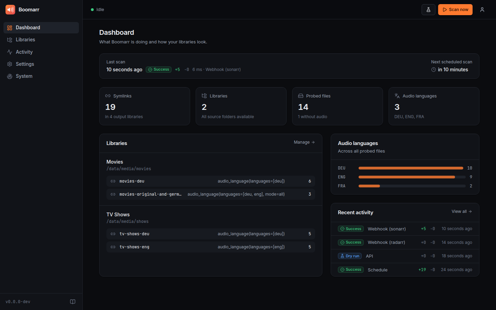

# Boomarr

{ width="96" }

**Symlink-based audio language filter for Plex, Jellyfin & Emby** — Boomarr
mirrors your media library into separate folders that only contain (symlinks
to) the files you want, e.g. a German-only library for the family, a 4K
library, or "original + German dub".

```
/data/media/movies                     /data/filtered/movies-deu
├── Film A (2020)/Film A.mkv  deu,eng  ├── Film A (2020)/Film A.mkv  -> …
├── Film B (2021)/Film B.mkv  eng      ├── Film C (2022)/Film C.mkv  -> …
└── Film C (2022)/Film C.mkv  ger      └── Film C (2022)/Film C.de.srt -> …
```

No files are copied, moved or modified, and no disk space is used.



## Highlights

- **Web UI** to configure and monitor everything: visual library and filter
  editor, live scan progress, history of every change, health checks, logs;
  login with password, **OIDC single sign-on** or reverse-proxy auth.
- Filter by **audio language** (`ger`/`deu`/`de` are the same), resolution,
  video/audio codec and channels; combine and invert filters.
- **Fast and always correct**: probe results are cached, every scan
  reconciles the output with the current config.
- **Safe by design**: read-only sources, only own symlinks are removed,
  unmounted shares and mass deletions are detected.
- **Integrations**: Sonarr/Radarr webhooks and language data, Prometheus
  metrics, Apprise notifications, Plex/Jellyfin/Emby refresh.
- **Runs anywhere**: multi-arch Docker image, Helm chart, Unraid template,
  pip/pipx with systemd.

## Next steps

1. [Install Boomarr](installation.md)
2. Open the [web UI](web-ui.md) on port 9797 and add your libraries (or use
   the [YAML reference](configuration.md))
3. [Set up your media server](media-servers.md) — read the *path mapping*
   section, it is the most common pitfall.
