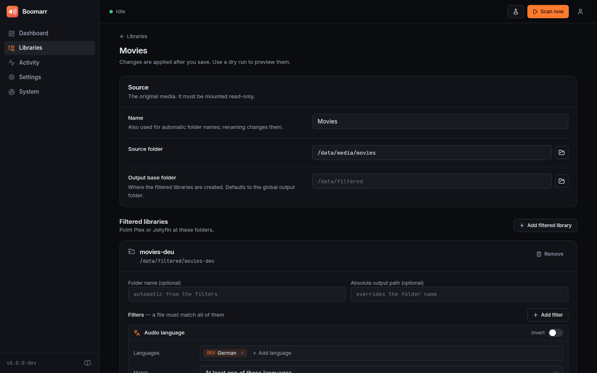

# Web UI & security

`boomarr watch` serves a web interface on port **9797**. Everything in
`boomarr.yml` can be configured there, and it shows what Boomarr is doing
right now: scan progress, the history of every scan with the links it
created or removed, health checks and live logs.


- [First start](#first-start)
- [What you can do in the UI](#what-you-can-do-in-the-ui)
- [How settings are stored](#how-settings-are-stored)
- [Authentication](#authentication)
- [Single sign-on (OpenID Connect)](#single-sign-on-openid-connect)
- [Reverse proxies](#reverse-proxies)
- [API key, webhooks and the REST API](#api-key-webhooks-and-the-rest-api)
- [Security notes](#security-notes)

## First start

Open `http://<host>:9797/`. Boomarr asks you to create the admin account.

- From a **private network** (192.168.x.x, 10.x.x.x, 172.16–31.x.x, IPv6
  ULA/link-local, localhost) that's all.
- From anywhere else you also need the **setup token** printed in the log,
  so nobody can claim a freshly started instance that is reachable from the
  internet:

  ```bash
  docker logs boomarr 2>&1 | grep "Setup token"
  ```

To skip the setup page (Kubernetes, Ansible…) set `BOOMARR_USERNAME` and
`BOOMARR_PASSWORD`. The account is created or updated on every start.

## What you can do in the UI

| Page | |
| --- | --- |
| **Dashboard** | Current scan with live progress, last/next scan, symlink and cache statistics, audio languages found, health warnings. *Scan now*, *Dry run* and *Cancel* are always one click away (top bar). |
| **Libraries** | Add and edit libraries: folder picker for the source/output paths, one or more filtered libraries per source with a visual filter builder (audio language with search, resolution, video/audio codec, channels, invert), and a live preview of the resulting output folder. |
| **Activity** | Every scan (schedule, webhook, manual, dry run) with outcome, duration and counts. Click a scan to see exactly which links were created or removed. |
| **Settings** | General, scanning (schedule, debounce, removal guard), probers (FFprobe, Sonarr, Radarr) and media servers (Plex, Jellyfin, Emby) with a *Test* button, notifications (Apprise, with test), security, web server and logging. |
| **System** | Version and paths, health checks, live logs with filter/search/download, configuration backup and restore. |

Changes are collected until you press **Save changes** in the bar at the
bottom, then validated, written and applied immediately, without a restart.
Only listener settings of the web server (`host`, `port`, `url_base`,
`trusted_proxies`) need a restart, which the UI tells you about.



## How settings are stored

`boomarr.yml` stays the single source of truth. The UI reads and writes that
file, so you can still edit it by hand, keep it in git or deploy it with a
ConfigMap:

- Writes are **validated** first (the same rules as on startup), **atomic**
  and keep the previous version as `boomarr.yml.bak`.
- If the file changed on disk after you opened the page, saving is refused
  instead of silently overwriting (optimistic locking).
- **Secrets** (API keys, tokens, notification URLs, the OIDC client secret)
  are never sent to the browser; the UI only shows that a value is set and
  lets you replace it.
- Values that come from **environment variables** or CLI options are shown
  with an *env* badge, cannot be changed in the UI and are never written to
  the file.
- If the file is **read-only** (e.g. a Kubernetes ConfigMap), the UI shows
  the settings but does not allow changes.
- The UI rewrites the file in a minimal form (only non-default values);
  comments of a hand-written file are not preserved.

Login data lives separately in `auth.json` (mode `0600`) next to the config:
the password hash (Argon2id), the generated API key and the key used to sign
sessions. Keep it private; deleting it resets the account (Boomarr asks for
a new one).

**Backups:** *System → Backup* downloads `boomarr.yml` and restores an
uploaded file after validating it.

## Authentication

```yaml
auth:
  method: forms            # forms | external | none
  local_bypass: false      # no login from private networks
  session_days: 30         # how long "keep me signed in" lasts
  external_header: Remote-User
```

| Method | |
| --- | --- |
| `forms` (default) | Login page with the local admin account and/or [single sign-on](#single-sign-on-openid-connect). |
| `external` | Your reverse proxy authenticates users (Authelia, Authentik or oauth2-proxy *forward auth*, Cloudflare Access …) and passes the user name in `external_header`. The header is **only trusted from `server.trusted_proxies`**, so it cannot be spoofed by clients that reach Boomarr directly. |
| `none` | No authentication. Only use this behind another authentication layer. |

`local_bypass: true` skips the login for requests from private addresses,
like *"Authentication required: Disabled for local addresses"* in the \*arr
apps.

Sessions are signed, `HttpOnly`, `SameSite=Lax` cookies (`Secure` over
HTTPS). Changing the password or *Sign out all sessions* (Settings →
Security) invalidates every existing session. Five failed logins from one
address lock that address out for five minutes.

## Single sign-on (OpenID Connect)

Works with any OpenID Connect provider: Authentik, Authelia, Keycloak,
Pocket ID, Zitadel, Kanidm, Google, Microsoft Entra ID …

```yaml
auth:
  method: forms
  oidc:
    enabled: true
    name: Authentik                 # button label
    issuer: https://auth.example.com/application/o/boomarr/
    client_id: boomarr
    client_secret: change-me        # omit for public clients
    scopes: [openid, profile, email]
    username_claim: preferred_username
    groups_claim: groups
    allowed_groups: [media-admins]  # empty: everyone the provider lets in
    allowed_users: []               # user names or e-mail addresses
    auto_login: false               # skip the login page
    disable_password_login: false   # SSO only
```

Register `https://<boomarr>/api/v1/auth/oidc/callback` as redirect URI (the
exact value is shown in Settings → Security). Boomarr uses the authorization
code flow with PKCE, verifies the ID token signature against the provider's
JWKS as well as issuer, audience, expiry and nonce, and falls back to the
userinfo endpoint for missing claims.

Keep a local account (don't enable `disable_password_login` right away)
until SSO works.

## Reverse proxies

Boomarr works behind any reverse proxy, also under a sub path:

```yaml
server:
  url_base: /boomarr                  # https://example.com/boomarr/
  trusted_proxies: [172.16.0.0/12]    # your proxy / Docker network
```

`trusted_proxies` makes Boomarr use `X-Forwarded-For` and
`X-Forwarded-Proto` from those addresses (correct client address for
`local_bypass` and the login throttle, secure cookies behind TLS). Live
updates use server-sent events: disable response buffering for
`/api/v1/events` if your proxy buffers (nginx: `proxy_buffering off;`,
Boomarr already sends `X-Accel-Buffering: no`).

```nginx
location /boomarr/ {
    proxy_pass http://boomarr:9797;
    proxy_set_header Host $host;
    proxy_set_header X-Forwarded-For $proxy_add_x_forwarded_for;
    proxy_set_header X-Forwarded-Proto $scheme;
    proxy_buffering off;
}
```

## API key, webhooks and the REST API

Boomarr generates an API key on first start (Settings → Security; show,
copy, regenerate). A fixed key can be set with `server.api_key` or
`BOOMARR_API_KEY`. It is accepted as `X-Api-Key` header, `?apikey=` query
parameter, `Authorization: Bearer <key>` or as the password of HTTP basic
auth, which is what Sonarr/Radarr webhooks use
([setup](configuration.md#http-server-webhooks-metrics-status)).

Everything the UI does is a REST call under `/api/v1/` and works with the
API key too; the OpenAPI description is served at `/api/openapi.json`.

```bash
curl -X POST -H "X-Api-Key: $KEY" http://boomarr:9797/api/v1/scans \
     -H 'Content-Type: application/json' -d '{"dry_run": true}'
curl -H "X-Api-Key: $KEY" "http://boomarr:9797/api/v1/scans?limit=5"
```

## Security notes

- Mutating requests from the browser require an `X-Requested-With` header
  in addition to the `SameSite` session cookie (CSRF protection); API-key
  requests are not affected.
- Responses carry a strict `Content-Security-Policy` (no inline scripts, no
  third-party resources), `X-Content-Type-Options` and a restrictive
  `Referrer-Policy`/`Permissions-Policy`. The UI loads no external fonts,
  scripts or trackers.
- `/health` is always public (for probes); `/metrics` is public unless
  `server.metrics_auth` is enabled.
- The folder picker lists directories (not files) and is only available to
  signed-in users.
- Report vulnerabilities privately, see
  [SECURITY.md](https://github.com/EuleMitKeule/boomarr/blob/master/SECURITY.md).
